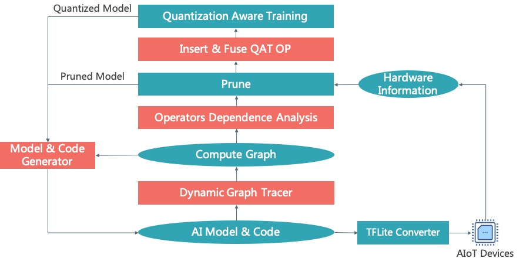

# TinyNeuralNetwork
[简体中文](README_zh-CN.md)

TinyNeuralNetwork is an efficient and easy-to-use deep learning model compression framework, which contains features like neural architecture search, pruning, quantization, model conversion and etc. It has been utilized for the deployment on devices such as Tmall Genie, Haier TV, Youku video, face recognition check-in machine, and etc, which equips over 10 million IoT devices with AI capability.

## Installation

Python >= 3.6, PyTorch >= 1.4（ PyTorch >= 1.6 if quantization-aware training is involved ）

```shell
# Install the TinyNeuralNetwork framework
git clone https://github.com/alibaba/TinyNeuralNetwork.git
cd TinyNeuralNetwork
python setup.py install

# Alternatively, you may try the one-liner
pip install git+https://github.com/alibaba/TinyNeuralNetwork.git
```

## Contributing

We appreciate your help for improving our framework. More details are listed [here](CONTRIBUTING.md).

## Basic modules

+ Computational graph capture: The Graph Tracer in TinyNeuralNetwork captures connectivity of PyTorch operators, which automates pruning and model quantization. It also supports code generation from PyTorch models to equivalent model description files (e.g. models.py).
+ Dependency resolving: Modifying an operator often causes mismatch in subgraph, i.e. mismatch with other dependent operators. The Graph Modifier in TinyNeuralNetwork handles the mismatchs automatically within and between subgraphs to automate the computational graph modification.
+ Pruner: OneShot (L1, L2, FPGM), ADMM, NetAdapt, Gradual, End2End and other pruning algorithms have been implemented and will be opened gradually.
+ Quantization-aware training: TinyNeuralNetwork uses PyTorch's QAT as the backend (we also support simulated bfloat16 training) and optimizes its usability with automating the fusion of operators and quantization of computational graphs (the official implementation requires manual implementation by the user, which is a huge workload).
+ Model conversion: TinyNeuralNetwork supports conversion of floating-point and quantized PyTorch models to TFLite models for end-to-end deployment.
  

## Project architecture

+ [examples](examples): Provides examples of each module
+ [models](models): Provides pre-trained models for getting quickstart
+ [tests](tests): Unit tests
+ [tinynn](tinynn): Code for model compression
    + [graph](tinynn/graph) : Foundation for computational graph capture, resolving, quantization, code generation, mask management, and etc
    + [prune](tinynn/prune) : Pruning algorithms
    + [converter](tinynn/converter) : Model converter
    + [util](tinynn/util): Utility classes

## RoadMap
+ Nov. 2021: A new pruner with adaptive sparsity
+ Dec. 2021: Model compression for Transformers

## Frequently Asked Questions

Because of the high complexity and frequent updates of PyTorch, we cannot ensure that all cases are covered through automated testing.
When you encounter problems You can check out the [FAQ](docs/FAQ.md), or join the Q&A group in DingTalk via the QR Code below.


