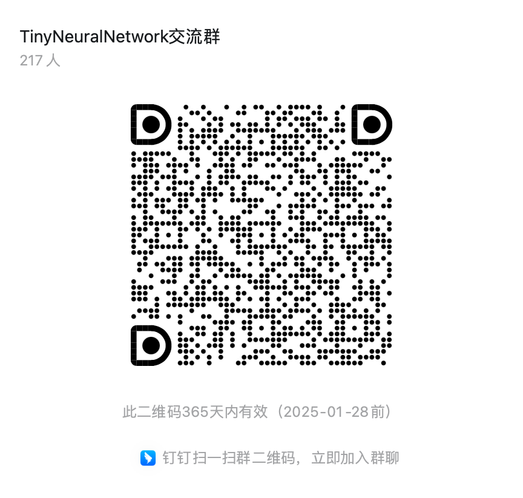

# Quantization-aware Training
[简体中文](README_zh-CN.md)

TinyNeuralNetwork uses PyTorch ([PyTorch Quantization-aware Training Tutorial](https://pytorch.org/tutorials/advanced/static_quantization_tutorial.html#quantization-aware-training) )
as the backend for quantization-aware training and focuses on optimizing its usability (**Please use PyTorch 1.6 and later due to the frequent updates of quantization part**).

## The quantization process in PyTorch
1. Modify the forward function of the model to insert `QuantStub`s and `DeQuantStub`s for the inputs and outputs.
2. Manually replace all `add`, `mul` and `cat` operations in the model with the alternatives in `torch.nn.quantized.FloatFunctional`. For example, the line of code `x = a + b` in the forward function requires the creation of a corresponding module `self.add0 = torch.nn.quantized.FloatFunctional()` and the line is written as `x = self.add0.add(a, b)` instead in the `forward` function.
3. Write the `fuse_model` function to manually fuse the operators. For example, the adjacent `Conv2D` and `BatchNorm2D` modules need to be fused to a `ConvBN2D` module. 
(More complex model means more time-consuming operation. Usually, this causes a huge workload)
4. Call `torch.quantization.prepare_qat` to convert the computational graph into a quantized computational graph (using this function, it tries to perform quantization on the whole computation graph. If you need mixed precision quantization, some dirty hacks or splitting the model may help.)
5. Create the quantized model via `torch.quantization.convert`. However, it can only be converted to TorchScript, not ONNX, TFLite or other mobile-friendly formats, making deployments difficult.

## The quantization process in TinyNeuralNetwork
+ Generate a new model description script `model.py` based on the model provided by the user (*which is equivalent to step 1 and 2 above*)
+ A more efficient `prepare_qat` function that automatically fuses the operators within the graph and performs the analysis for mixed precision quantization (*which is equivalent to steps 3, 4 above*)
+ Use direct conversion from TorchScript to TFLite (*supporting both floating-point and quantized models*) to simplify the end-to-end deployment.

## Frequently Asked Questions

Because of the high complexity and frequent updates of PyTorch, we cannot ensure that all cases are covered through automated testing. When you encounter problems
You can check out the [FAQ](../../docs/FAQ.md), or join the Q&A group in DingTalk via the QR Code below.

